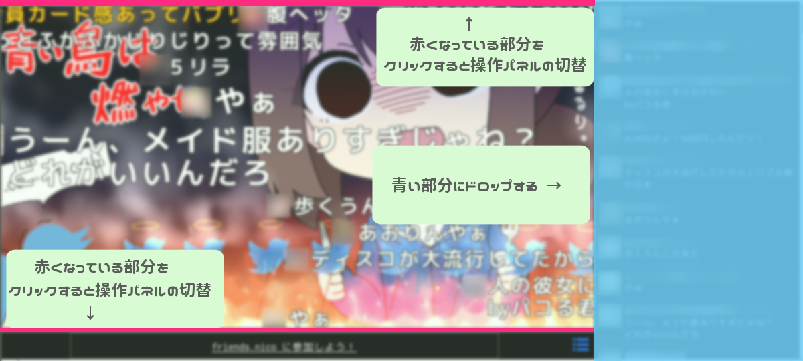
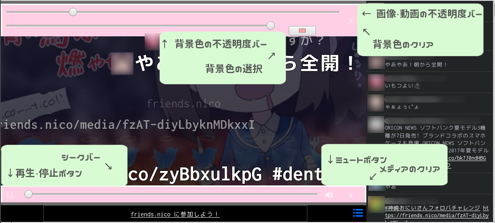

# withNicome

## 目次
- [これなに？](#これなに)
- [特徴](#特徴)
- [使い方](#使い方)
- [インストール](#インストール)
- [パッケージ化](#パッケージ化)
- [その他](#その他)

## これなに？

ニコニコのマストドン(friends.nico)用Web Extensionです。  
[ニコニコ形式](https://friends.nico/nicomment)のコメントエリアで動画を再生します。  
  
 動画では[こんな感じ](https://friends.nico/@12/21759031)。  
通常のWeb画面にコメント形式を表示することもできます。  

## 特徴

* Firefox系だけでなくChrome系などでも(多分)動作
* jQueryなどの外部ライブラリなしで動作
* Node.jsなどの依存なしで開発(環境の問題で入れられない)
* モジュール化されない可読性の低いコード

## 使い方

### コメント形式利用時
  
コメントスクロール部分がドラッグ・アンド・ドロップ可能になっています。  
再生したい動画・音声ファイルをドロップすることで再生を開始できます。  
画像をドロップした場合、背景として設定されます。  
  
上下の細いバーをクリックするとそれぞれ操作パネルが出てきます。  
上のスライドバーで動画・画像/背景色の不透明度を調整できます。  
下のメディア操作バーで再生/停止、シーク、ミュートができます。  
もう一度クリックすると非表示になります。  
(Firefox系の場合、ブラウザ側のコントローラを使用するとニコるのがずれた際にメディアの誤操作に繋がるのでこちらを使用することをおすすめします)

## インストール

1. ブラウザにあった形式を[ここからダウンロード](https://github.com/choco-la/nicomment/releases/)
    * Firefox等なら拡張子がxpi
    * Chrome等なら拡張子がcrx
2. Chrome等のChromium系ブラウザでは開発者モードを有効にしておく
3. ブラウザにドラッグ&ドロップ

## パッケージ化

* Firefox系  
`$ zip -r addon.xpi icons/ js/ manifest.json`  
* Chrome系  
開発者モードからパッケージ化できます。  

## その他

* 動作確認環境
OS: Xubuntu 16.04 LTS  
ブラウザ: Firefox 最新版(Canonical版)  

* ライセンス  
GNU General Public License v3.0  

* ニコニコ動画の動画観たいんだけど？  
現状の仕様では[セキュリティ上の問題](https://friends.nico/@12/19593249)で難しいです。  

* デモに使用させて頂いた画像・動画  
[ラマーズPさん](https://friends.nico/@lamazeP)  